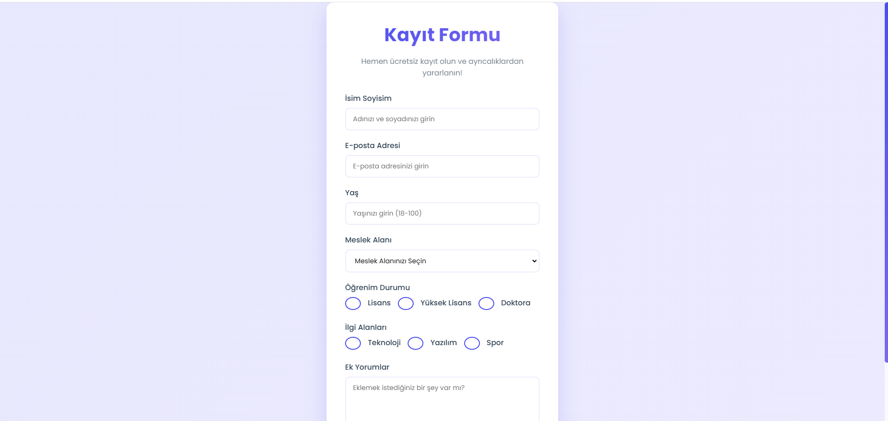

# Modern Kayıt Formu | Modern Registration Form

## 🇹🇷 Türkçe Açıklama

### Proje Hakkında
Bu proje, modern ve estetik bir kayıt formu uygulamasıdır. Kullanıcı dostu arayüz ve detaylı form özellikleriyle öne çıkan bir web sayfası tasarımı içerir.

### Özellikler
- Responsive Tasarım
- Modern UI/UX
- HTML5 Form Validasyonu
- Gradient Arka Planlar
- Hassas Alan Kontrolleri
- Şık Animasyonlar

### Kullanılan Teknolojiler
- HTML5
- CSS3
- Responsive Design
- Font Awesome Icons
- Gradient Stilleri
- Modern Tipografi

### Ekran Görüntüleri

### Kurulum
1. Depoyu klonlayın
2. `index.html` dosyasını tarayıcınızda açın

### Katkıda Bulunma
1. Depoyu fork edin
2. Özellik branchi oluşturun
3. Değişikliklerinizi commit edin
4. Brancha push yapın
5. Yeni bir Pull Request açın

## 🇬🇧 English Description

### About the Project
This project is a modern and aesthetic registration form application. It features a user-friendly interface with detailed form capabilities.

### Features
- Responsive Design
- Modern UI/UX
- HTML5 Form Validation
- Gradient Backgrounds
- Precise Input Controls
- Elegant Animations

### Technologies Used
- HTML5
- CSS3
- Responsive Design
- Font Awesome Icons
- Gradient Styles
- Modern Typography

### Screenshots

### Setup
1. Clone the repository
2. Open `index.html` in your browser

### Contributing
1. Fork the repository
2. Create a feature branch
3. Commit your changes
4. Push to the branch
5. Create a new Pull Request

### License
This project is open-source and available under the MIT License.

### Contact
- Email: info@aemreari.com.tr
- LinkedIn: [Ahmet Emre ARI](https://www.linkedin.com/in/aemreari/)
- GitHub: [ahmetemreari](https://github.com/ahmetemreari)
